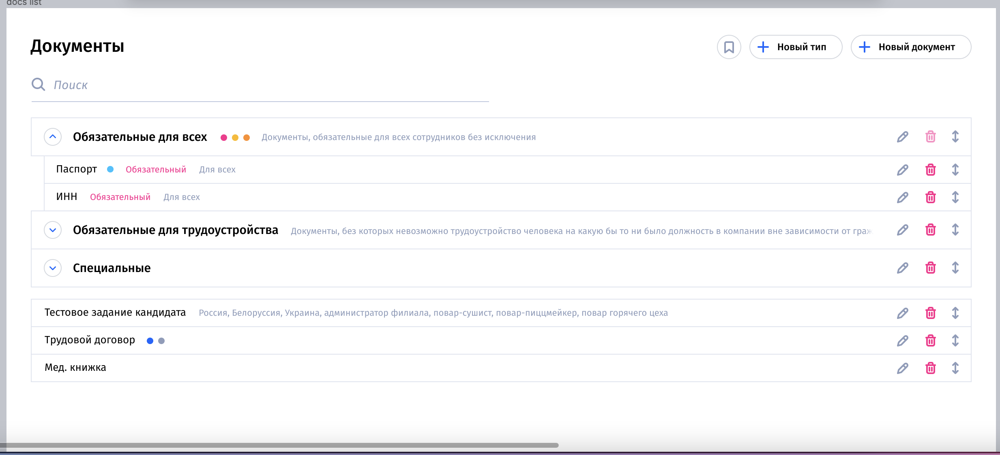
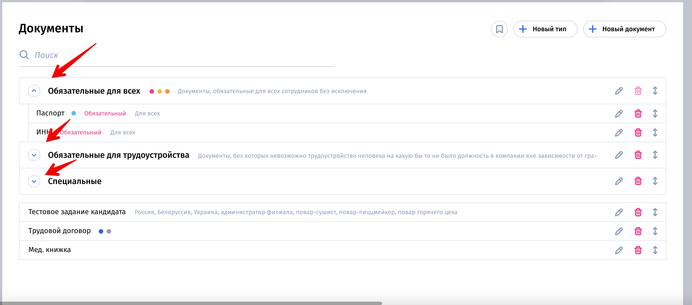
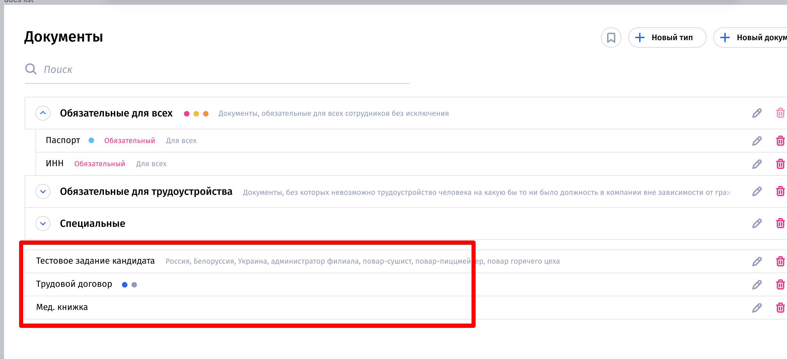
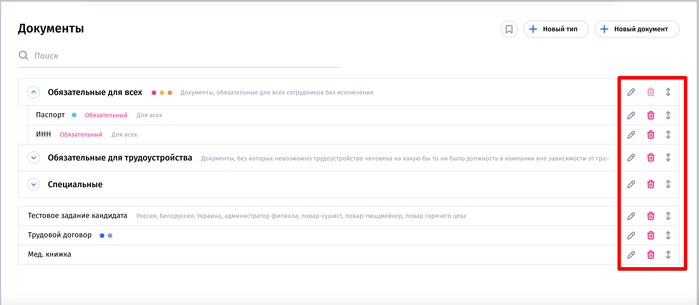
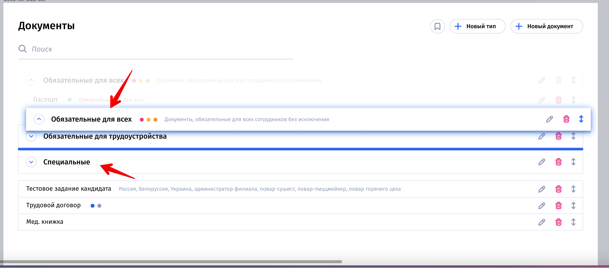
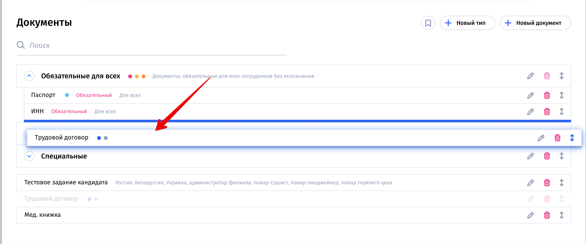
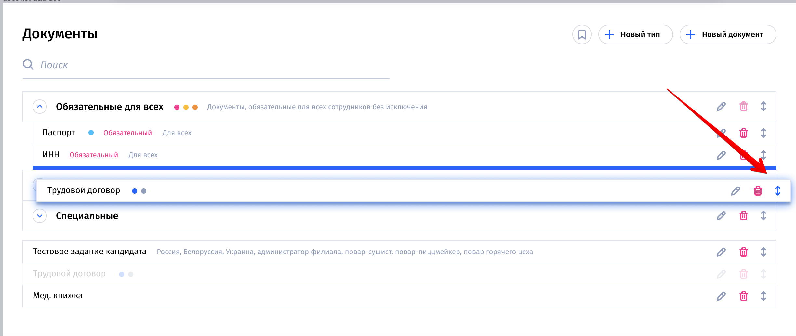
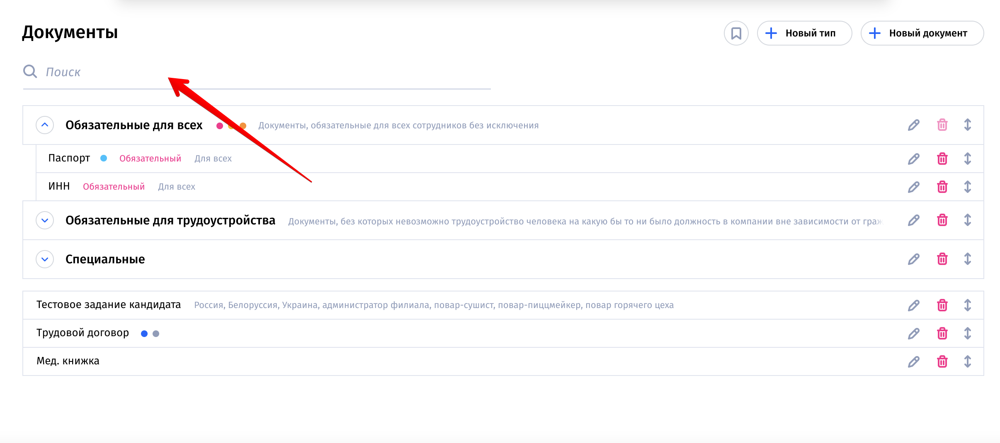
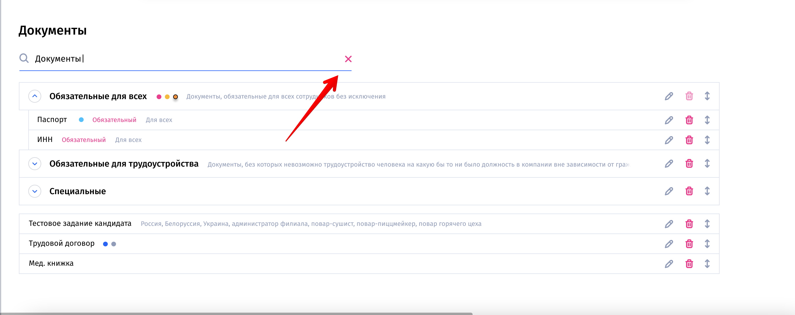

# Foquz

# Макет

https://www.figma.com/file/W7qIKLBDyyRd4pHqy0KCOe/test-front?node-id=3031%3A5

Скачать макет: https://drive.google.com/file/d/1ndiZcNcRKCHjuagMkwuzW1BLZHt3xe6q/view

# Общее

1. Для разработки использовать vue.js
2. Действия должны быть плавными
3. Только для десктопа, адаптив в рамках этой задачи - не нужен

# Описание

Нужно сделать вёрстку раздела _Документы_: 

На первом уровне отображаются категории, которые можно свернуть и развернуть: 

На первом уровне также отображаются элементы, которые не относятся к категориям и отображаются внизу списка с категориями: 

Для каждого элемента в списке отображаются кнопки: _Удалить_, _Редактировать_, _Переместить_: 

В рамках задачи нужно добавить функционал "перемещения элемента в списке". Категории можно перемещать только между собой: 

Таким образом, с помощью перемещения можно менять порядок. Элементы внутри категории можно перемещать как внутри самой категории, так и между категориями и вытаскивать в список без категории: 

Перетаскивать элементы в списке можно при клике на кнопку _Переместить_: 

Также нужно добавить поиск по подстроке по названиям категорий и названиям элементов в категории: 

Поиск должен работать на ввод символов. При вводе хотя бы одного символа показывать кнопку "Сбросить" ("крестик"): 
